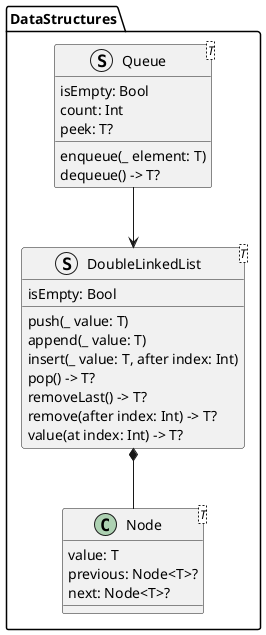

# DataStructures

Пакет содержит набор структур данных:

- DoubleLinkedList -- связаный двунаправленный список;
- Queue -- очередь на основе связаного двунаправленного списока.

## Описание пакета

Структура 'DoubleLinkedList' реализует связаный двунаправленный список, состоящий из экземпляров класса 'Node' -- узлов списка.

- `var isEmpty: Bool` -- возвращает логическое значение, определяющее пустой список или нет;
- `func push(_ value: T)` -- добавление элемента в начало списка;
- `func append(_ value: T)` -- добавление элемента в конец списка;
- `func insert(_ value: T, after index: Int)` -- вставка в середину двунапрвленного списка;
- `func pop() -> T?` -- извлечение из начала списка;
- `func removeLast() -> T?` -- извлечение из конца списка;
- `func remove(after index: Int) -> T?` -- извлечение из середины списка;
- `func value(at index: Int) -> T?` -- возвращает значение по индексу.

Структура 'Queue' реализует очередь из элементов связаного двунаправленного списока.

- `var isEmpty: Bool` -- возвращает логическое значение, указывающее, пустая ли очередь;
- `var count: Int` -- возвращает количество элементов в очереди;
- `var peek: T?` -- возвращает первый элемент в очереди;
- `func enqueue(_ element: T)` -- добавляет элемент в конец очереди;
- `func dequeue() -> T?` -- удаляет и возвращает первый элемент очереди.

## UML-схема 

